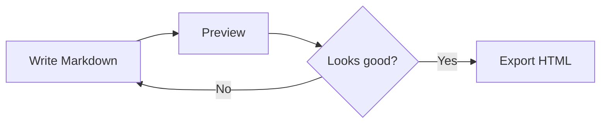

# README (Markdown)

A Markdown writing environment for [Tinderbox](https://www.eastgate.com/Tinderbox/) with syntax highlighting, GitHub-styled preview, and HTML export. Includes [Mermaid](https://mermaid.js.org/) diagrams, [MathJax](https://www.mathjax.org/) math rendering, and [Prism](https://prismjs.com/) code highlighting out of the box.

**This installer replaced/updated the built-in Markdown prototype.**

## Quick Start

1. Preview the `/Assets/Custom Styles` CSS note (this loads the styling for preview)
2. Create a new note
3. Set its `$Prototype` to **Markdown**
4. Start writing Markdown
5. Use **Option-Command-E** to toggle Preview

## What's Installed

**Prototypes**

- **Markdown** — Apply to any note for Markdown editing. Sets up Menlo font, syntax highlighting, Markdown preview, and HTML export via the included templates.
- **Code** — For code and asset notes (CSS, JS). Exports as raw text without HTML markup.
- **HTML** — For templates and assets. Enables HTML markup, disables Markdown processing, and auto-assigns to child notes.

**Syntax Highlighter**

- **Markdown** — Highlights headings, bold, italic, links, footnotes, code blocks, blockquotes, task lists, and URLs.

**Templates**

- **Text Only** — Outputs raw `$Text` with no wrapping markup. Used by the Code prototype.
- **HTML Markdown and Children** — Full HTML page template with recursive child inclusion. Includes metadata, styles, and scripts for Prism, MathJax, and Mermaid.

**Assets**

- **Custom Styles** — Your CSS overrides (exported as `Assets/Custom Styles.css`). Edit this to customize appearance.

## Mermaid, MathJax, and Prism

The HTML template includes CDN-loaded support for:

- **[Mermaid](https://mermaid.js.org/)** — Diagrams and flowcharts. Use a fenced code block with the `mermaid` language tag. Automatically respects light/dark mode.
- **[MathJax](https://www.mathjax.org/)** — Math rendering. Use `\(...\)` for inline math and `\[...\]` or `$$...$$` for display math.
- **[Prism](https://prismjs.com/)** — Syntax highlighting for code blocks in Preview and export. Use fenced code blocks with a language tag (e.g., ` ```javascript `). Includes copy-to-clipboard and automatic language detection. Uses GitHub-themed light/dark styles.

These work in both Preview and HTML export with no additional setup.

### Examples

**Mermaid diagram** — a simple flowchart:



**Code highlighting** — JavaScript with Prism:

```javascript
function greet(name) {
  return `Hello, ${name}!`;
}
console.log(greet("Tinderbox"));
```

**Math rendering** — the quadratic formula with MathJax:

$$x = \frac{-b \pm \sqrt{b^2 - 4ac}}{2a}$$

Inline math works too: the area of a circle is $A = \pi r^2$.

## Customizing

**CSS** — Edit `/Assets/Custom Styles` to override any GitHub Markdown styles.

**Templates** — Edit `/Templates/HTML Page and Children` to change the page structure, add/remove CDN scripts, or modify metadata. Edit the child `HTML item` to change how child notes render.

**Highlighter** — Edit `/Hints/Highlighters/Markdown` to adjust syntax colors, sizes, or add new patterns.

## MultiMarkdown

If `mmd` was found on your system, `$HTMLPreviewCommand` is set to use it with sed post-processing that fixes bold/italic/link rendering issues.

If `mmd` was not found, `$HTMLPreviewCommand` is set to "CommonMark" (one of Tinderbox's built-in parsers).

**Installing MultiMarkdown**

[MultiMarkdown](https://fletcherpenney.net/multimarkdown/) is installed using [Homebrew](https://brew.sh/), a free package manager for macOS. If you don't already have Homebrew, you only need to install it once — it's widely used and makes it easy to install command-line tools.

1. Open **Terminal** (found in Applications > Utilities, or search for it with Spotlight)
2. If you don't have Homebrew yet, paste this line and press Return:
   `/bin/bash -c "$(curl -fsSL https://raw.githubusercontent.com/Homebrew/install/HEAD/install.sh)"`
   Follow the on-screen prompts to complete the installation.
3. Once Homebrew is installed, paste this line and press Return:
   `brew install multimarkdown`
4. Re-run the Tinderbox installer to pick up the new `mmd` command.

## Notes

- The Markdown prototype uses a syntax highlighter, which disables Tinderbox's rich text formatting (bold, italic, font changes, etc.) in the text pane. This is by design — formatting is expressed through Markdown syntax instead (e.g., `**bold**`, `*italic*`) and rendered in Preview and on export.
- The installer is safe to re-run; it uses `create()` which updates existing notes
- Assign this prototype to any note to enable Markdown: set `$Prototype` to "Markdown"
